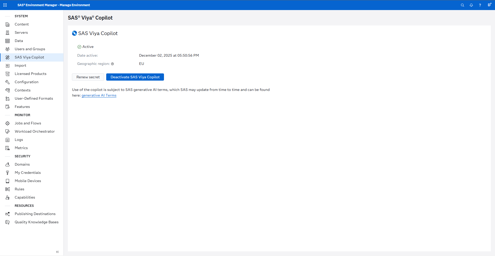
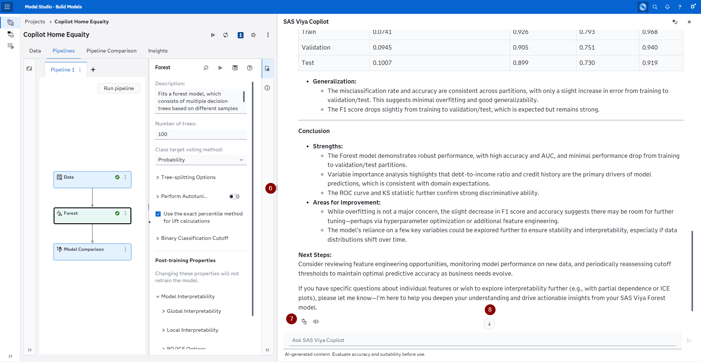
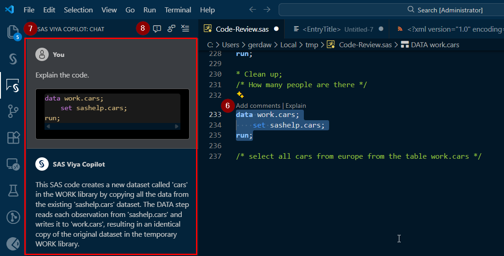

# 2025.12 - The Copilot Release

With this release we saw 81 new features being added. The highlight is of course the introduction of the SAS Viya Copilot for SAS Model Studio, SAS Model Manager and the SAS Copilot Extension for Visual Studio Code. If you are interested in seeing this in action check out my YouTube video on this release as well - [Into the Viya Verse Episode 36](https://youtu.be/pA7MPltKg5U).

Of course there are other features that I want to highlight in this release, you can use the table of contents on the right hand side to quickly navigate to all the different topics.

## The SAS Viya Copilot

First let us touch on what the SAS Viya Copilot is and how you can enable it for your environment.

The SAS Viya Copilot is a Software as a Service (SaaS) feature that provides the capability to chat with SAS Viya applications, help you build new content, generate code or answer questions about the technical details. To learn more please check out this introduction to the [SAS Viya Copilot in the SAS Documentation](https://go.documentation.sas.com/doc/en/copilotcdc/v_001/copilotov/p1bmbuzaxwkj0gn1mur9iv06fw4l.htm).

In oder to enable the SAS Viya Copilot you need to have an environment that has been updated to 2025.12, is connected to the internet and you have to be a SAS Administrator on the environment. Next you have to navigate to the new SAS Viya Copilot page in the SAS Environment Manager:

More information about this page can be found here in the [SAS Documentation](https://go.documentation.sas.com/doc/en/sasadmincdc/v_071/evfun/p01y7i47bsmr8dn153kufzh7mia6.htm).

As the SAS Administrator you will need to setup the credentials that are used to authenticate your environment for the SAS Viya Copilot - for this please follow the instructions in the [SAS Documentation](https://go.documentation.sas.com/doc/en/sasadmincdc/v_071/callicense/p1ii465hpdnkoan1fx3ybdin9q5s.htm).

Once you have setup and activated the SAS Viya Copilot it is available in all the applications that currently support the Copilot for all users that have access to these applications.

### Using the SAS Viya Copilot in SAS Model Studio

The SAS Viya Copilot is located in the top right hand corner. Clicking the icon will bring up the Copilot side pane:

1. Click this icon to bring up the SAS Viya Copilot or dismiss it.
2. This is the sidepane which contains the Copilot.
3. If the first icon you can create a new conversation with the Copilot and with the second you can dismiss it.
4. Here is the chat input to ask your own questions - hitting the *Enter* key functions as a send option.
5. The Copilot offers next actions as quick access buttons that you can just click to trigger the action.

Let's take a look at the result generated after clicking on the *Explain the node results* button:

First we see that the resulting text is nicely formatted and can even contain things like tables to display information.
6. You can utilize these three vertical dots to drag the side pane and increase or decrease its size depending on your needs.
7. The first icon copies the Copilot response for you (in the Markdown notation) and the second icon utilizes the browser built in text-to-speech capability to read the response for you.
8. This arrow indicates that you aren't at the bottom of the conversation. Clicking the arrow takes you to the bottom of the conversation.

The SAS Viya Copilot in SAS Model Studio is available for all three project types:
- Data Mining and Machine Learning, in such a project the Copilot can help you by adding nodes, running nodes, improving nodes, getting information about nodes and its parameters, summarize the results of a node, determine the next node and answering general questions about SAS Viya Machine Learning - for more information see the [SAS Documentation](https://go.documentation.sas.com/doc/en/capcdc/v_035/vdmmlcdc/vdmmlug/p16i1i6qucr8xxn12tydb3uubopg.htm).
- Forecasting, in such a project the Copilot can help you by getting information about nodes and their parameters, learn which models to use in the Interactive Modeling node and answering general questions about SAS Visual Forecasting - for more information see the [SAS Documentation](https://go.documentation.sas.com/doc/en/capcdc/v_035/vfcdc/vfov/n1lrektztjaxjkn17xzjvcm3zpvb.htm).
- Text Analytics, in such a project the Copilot can help you by getting information about nodes and their parameters and answering general questions about SAS Visual Text Analytics - for more information see the [SAS Documentation](https://go.documentation.sas.com/doc/en/ctxtcdc/v_026/ctxtug/p0eegttpemq6b0n1k5rhszl96jda.htm).

There is a lot to explore here, so spin up a project and start experimenting with it!

### Using the SAS Viya Copilot in SAS Model Manager

The usage of the SAS Viya Copilot is just like described in SAS Model Studio.

The Copilot can answer general questions about SAS Model Manager. In the screenshot is the section *References* included which links to SAS Documentation that is relevant to your questions and provides you with the ability to dive even deeper:

For more information about this Copilot check out the [SAS Documentation](https://go.documentation.sas.com/doc/en/mdlmgrcdc/v_062/mdlmgrug/n0eqnrlyqhjn6mn1qmm5oxw29n3y.htm).

### Using the SAS Viya Copilot in Visual Studio Code

In order to make use of the Copilot in Visual Studio Code (VSCode), you have to install the following two extension that are provided and distributed by SAS:
- [SAS Extension for VSCode](https://marketplace.visualstudio.com/items?itemName=SAS.sas-lsp), this is the main extension that enables you to connect with both SAS Viya and SAS 9.4 environments.
- [SAS Viya Copilot](https://marketplace.visualstudio.com/items?itemName=SAS.sas-viya-copilot), this is the new and additional extension that enables this new feature.

In addition not only must the SAS Viya Copilot feature be turned on for your environment, but the SAS Administrator must also add you to the Custom Group *GenAI VSCode Users* in order to enable this feature.

Now let's take a look first at the general setup and the settings of the extension:

1. This is the icon for the SAS extension.
2. This is the icon for the SAS Viya Copilot extension.
3. In the settings of VSCode you can find a specific section for the SAS Viya Copilot.
4. Here you can toggle to always accept the generated code (default is off).
5. Here you can toggle to include the context that is included in addition to the comment that you highlighted.

Next let's open up a .sas program and start working with the Copilot:

6. When highlighting SAS code you can make use of the *Add comments* feature (which will add comments to your code directly) or the *Explain* feature which will write an explanation of the code to the SAS Viya Copilot: Chat pane.
7. By clicking on the SAS Viya Copilot icon you are taken to a chat pane where you can review all your interactions with the Copilot. Please note that this isn't a general chat interface and rather a log of the interactions triggered via the code editor.
8. The first icon enables you to report an issue (this takes you to the GitHub repository of this extension), the second icon enables you to send back general feedback and the third icon clears the conversation.

And finaly a look at the *Generate code* feature that comes up when highlighting a comment:

9. Highlight a comment and then click *Generate code* to trigger the generation process.
10. Once the code has finished generating you will see the result both in the SAS Viya Copilot: Chat and also by going through this little pop up where you can cycle through the different generations and accept the best version.

## SAS Visual Analytics

### Expanded Graph Options

This introduces all bunch of new options to the look and feel of graphs inside of SAS Visual Analytics. Giving you more control over things like colors, lines, axis and more.

These expanded options are available for 22 objects:
- Bar Charts (7 individual new options)
- Bubble Change Plots (7 individual new options)
- Bubble Plots (7 individual new options)
- Butterfly Charts (5 individual new options)
- Comparative Time Series Plots (8 individual new options)
- Dot Plots (3 individual new options)
- Dual Axis Bar Charts (6 individual new options)
- Dual Axis Bar-Line Charts (8 individual new options)
- Dual Axis Line Charts (3 individual new options)
- Dual Axis Time Series Plots (4 individual new options)
- Line Charts (5 individual new options)
- Needle Plots (4 individual new options)
- Numeric Series Plots (5 individual new options)
- Pie Charts (2 individual new options)
- Scatter Plots (2 individual new options)
- Schedule Charts (3 individual new options)
- Step Plots (7 individual new options)
- Targeted Bar Charts (6 individual new options)
- Treemaps (11 individual new options)
- Time Series Plots (5 individual new options)
- Vector Plots (3 individual new options)
- Waterfall Charts (4 individual new options)

There are new options available both for some of the individual objects (in the SAS Documentation this is expressed via *2025.12 and later* or *Expanded in 2025.12 and later*) and there is also options that are shared across them which can be found on this page in the [SAS Documentation](https://go.documentation.sas.com/doc/en/vacdc/v_036/vaobj/p0ff4c84fzvgifn1beckp7yubg0u.htm#n1hb4wdode9mdrn1vi9q03yxirs0). In total there is 20 of these general options.

Here are some of my personal highlights:
- *Axis label*, enables you to not only toggle if an axis label (both X & Y) is displayed, but now you can also change the *Text style, size, bold, italic & color*. In addition you can now provide a *Fixed label* which means that you can write a custom text and not just display the variable name. This is available for all the objects listed above.

- *Y axis*, specifies if the axis is displayed on the left (default) or right side of the plot. This is available for all objects above that have one Y axis.
- *Legend*, you now have a lot more capabilities to customize the borders of a legend and its title. This is available for all the objects listed above.

### Dynamic Reference Lines

You can now assign an applicable parameter (i.e. depending on the type of your x-axis), meaning the values can change in response to calculations, filters, data updates, etc.

To make a reference line dynamic make sure to create your parameter first via the *Data* pane (I have named mine *Test*), next go to your graph object of choice, open up the *Options* pane and go to the section about *Reference Lines*, in the *Value* dropdown you can still enter a static value or select your parameter.

## SAS for Microsoft 365

### Running SAS Viya Jobs in Microsoft Word

If you are using the SAS AddIn for Microsoft Word 365 than you can now also add SAS Viya Job outputs into your document.

1. Go to the *Reports* tab.
2. Navigate through your SAS Content folder structure to navigate to the folder that contains the Job Definition.
3. Double click (or right click > Open in Results) your Job Definition.

4. Go to the *Results* tab, if you haven't been navigated there automatically.
5. If you have multiple Jobs open in this document you can use the dropdown to switch between them.
6. The *Prompts* tab contains the UI of the Job.
7. In the *Log* tab you can view the SAS log of the last run.
8. In the *Results* tab you can view the SAS ODS result of the last run.
9. Use the *Run* button to start the job and the *Cancel* button to stop its run, if you realize you set the wrong parameters.
10. This button is used to update the graphics in the Word document - if you do not have graphics in the report yet you can insert it from here (though the icon will look different).
11. From this overflow menu you have a lot more options to interact with the outputs in your document.

If you want to learn more about the capabilities of the SAS AddIn for Microsoft Word 365, then check out the [SAS Documentation](https://go.documentation.sas.com/doc/en/amodoccdc/v_041/amoug/p0rxcthci3t8ybn1ahs2720mfsv2.htm).

## SAS Extension for Visual Studio Code

If you are not familiar with the SAS Extension for Visual Studio Code (VSCode), then take a look at my [overview video of it](https://youtu.be/aOrvqJjeLWo).

With version 1.18 there are three new features available in the extension:
1. You can sort columns in the data viewer (i.e. when you open up a table) and you can display its properties.

2. You can now collaps comment blocks in your code.

3. You can now view the properties of a dataset by right clicking (1) it in the libraries browser and selecting *Properties* (2). This is then opened in a new tab in VSCode (3) and here you also find the *Columns* properties tab (4).

These updates and more can be found in the CHANGELOG on the [GitHub repository](https://github.com/sassoftware/vscode-sas-extension/blob/main/CHANGELOG.md#v1180---2025-12-01) of the extension.

## SAS Studio

### Excluding a Node from Running

When you are building out a flow and especially as they get larger you might have the need to rerun parts of the flow but exclude specific once from the run. This is now enabled by right clicking (1) the node and from the context menu selecting *Exclude from run* (2). Doing this will grey-out the node in th flow.

You can still interact with the node, change its properties, etc. but if you run the flow this node will be excluded. To learn more about this check out the [SAS Documentation](https://go.documentation.sas.com/doc/en/sasstudiocdc/v_070/webeditorcdc/webeditorflows/p1uq61icn6okv0n1wo0zjatblys8.htm)

## SAS Programming

### Proc SUPERLEARNER

With this release we have gotten access to one additional base learner model and that is neueral networks. This enables us to consider even more models and adapt our learning strategies.

If you want to learn more about this proc than check out my first ever Proc Guide, that tries to provide a very focused step by step introduction to a proc - [Proc Guide: SUPERLEARNER](../procs/superLearners). And of course here is the link to that new base learner in the [SAS Documentation](https://go.documentation.sas.com/doc/en/pgmsascdc/v_070/casstat/casstat_superlearner_syntax02.htm#casstat.superlearner.nnet_model).